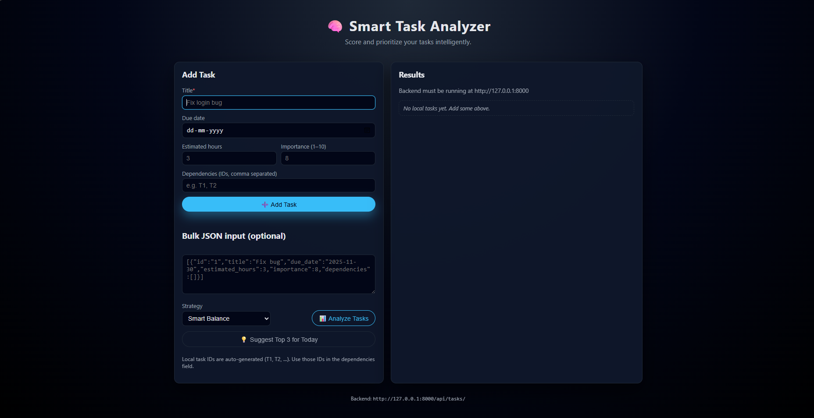
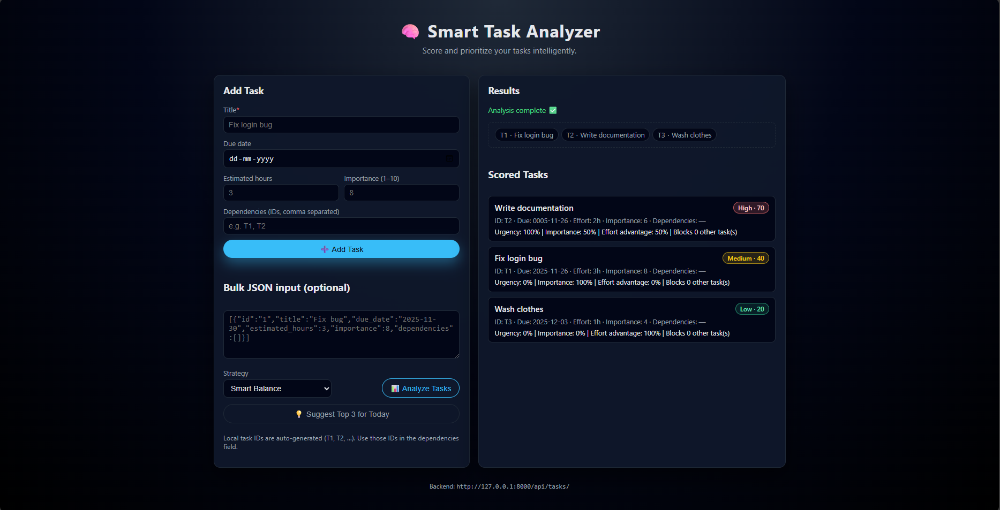

<h1 align="center">🧠 Smart Task Analyzer</h1>

  AI-powered intelligent task scoring & prioritization system. 
  Built with <b>Django REST Framework</b> + <b>Modern Frontend UI</b>.

  
  
  

---

## 📌 Overview

Smart Task Analyzer is a full-stack intelligent system that evaluates, ranks, and recommends tasks based on:

- **Urgency** (deadline-based)
- **Importance**
- **Effort**
- **Dependencies**
- **Weighted strategies** (Smart / Deadline-first / Impact-based)

Ideal for:
✔ Internship assignments  
✔ Productivity tools  
✔ AI-based prioritization systems  
✔ Portfolio projects  

---

## 🖼️ Demo UI

(Add your screenshots here)

Example:

---

## ✨ Features

### 🧠 Intelligent Scoring Algorithm  
A custom decision engine that calculates a score for each task based on:
- Time sensitivity
- Importance level
- Required effort
- Dependency impact

### 🥇 Suggest Top 3 Tasks  
Recommends the best tasks to do *right now* based on strategy.

### 🎨 Modern Frontend  
- Responsive UI  
- Smooth layout  
- Strategy dropdown  
- Bulk JSON task input  
- Clean task cards  

### 🔗 REST API  
| Endpoint | Method | Description |
|---------|--------|-------------|
| `/api/tasks/analyze/` | POST | Score and sort tasks |
| `/api/tasks/suggest/` | GET | Top 3 recommended tasks |

---

## 🛠️ Tech Stack

### **Backend**
- Django 5.2
- Django REST Framework
- django-cors-headers
- Python 3.x

### **Frontend**
- HTML5  
- CSS3 (Custom UI)  
- JavaScript  

---

## 📁 Folder Structure

